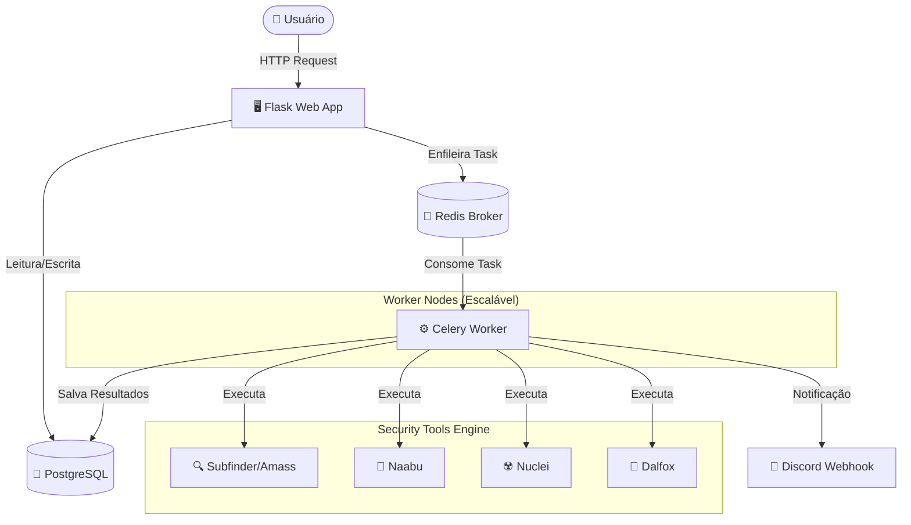

# 🛡️ BugBounty Monitor

> **Orquestrador de Segurança Ofensiva Automatizado**
>
> Uma plataforma robusta para gestão de reconhecimento (Recon) e análise de vulnerabilidades em escala, construída com arquitetura de microsserviços.


## 🧠 Arquitetura do Sistema

O projeto utiliza uma arquitetura assíncrona para garantir que scans pesados não travem a interface do usuário.



---

## 🚀 Funcionalidades Principais

### 🔍 Reconhecimento (Recon) Híbrido

* **Discovery:** Combinação de *Subfinder* e *Amass* (Passive) para máxima cobertura de subdomínios.
* **Live Check:** Filtragem de hosts ativos e coleta de *Tech Stack* (Wappalyzer logic) via *HTTPX*.
* **Port Scanning:** Varredura rápida de portas Top 100/1000 com *Naabu*.
* **Enriquecimento:** Coleta automática de DNS (CNAME, MX) e IPs.

### 🛡️ Vulnerability Scanning

* **Engine de Templates:** Uso do *Nuclei* para detecção de CVEs, Misconfigurations e Exposures.
* **Pipeline XSS:** Fluxo integrado: `Crawler (Katana)` → `Histórico (GAU)` → `Scanner (Dalfox)`.
* **CMS Intel:** Detecção precisa de versões de CMS (WordPress, Joomla, Drupal) via *CMSeeK*.

### ⚙️ Diferenciais de Engenharia

* **Smart Fuzzing:** O sistema diferencia subdomínios novos de antigos. O Fuzzing pesado (FFuf) roda **apenas em novos ativos**, economizando recursos e tempo.
* **Auto-Healing:** O container Web aguarda o Banco de Dados estar saudável antes de iniciar, evitando *Race Conditions*.
* **Seeding Automático:** O usuário Admin é criado automaticamente na primeira inicialização via variáveis de ambiente.

---

## 📂 Estrutura do Projeto

```text
BugBounty_Monitor/
├── app/
│   ├── static/          # Arquivos CSS/JS
│   ├── templates/       # HTML com Jinja2 e HTMX
│   ├── models.py        # Schema do Banco de Dados (SQLAlchemy)
│   ├── routes.py        # Endpoints da Aplicação
│   ├── scanner.py       # Wrappers para as ferramentas de CLI
│   ├── tasks.py         # Lógica dos Workers (Celery)
│   └── __init__.py      # Factory da Aplicação e Configs
├── docker-compose.yml   # Orquestração dos serviços
├── Dockerfile           # Imagem customizada com todas as tools instaladas
├── requirements.txt     # Dependências Python
└── .env                 # (Não versionado) Segredos e Configurações

```

---

## ⚙️ Instalação e Configuração

### Pré-requisitos

* [Docker](https://docs.docker.com/get-docker/) e [Docker Compose](https://docs.docker.com/compose/install/)

### 1. Clonar o Repositório

```bash
git clone https://github.com/Sonael/BugBounty_Monitor.git
cd BugBounty_Monitor

```

### 2. Configurar Variáveis de Ambiente

Crie um arquivo `.env` na raiz:

```bash
cp .env.example .env  # Se houver um exemplo, ou crie manualmente

```

**Tabela de Configuração (.env):**

| Variável | Descrição | Exemplo |
| --- | --- | --- |
| `POSTGRES_USER` | Usuário do Banco | `user` |
| `POSTGRES_PASSWORD` | Senha do Banco | `password` |
| `DATABASE_URL` | String de Conexão | `postgresql://user:password@db:5432/bugbounty` |
| `CELERY_BROKER_URL` | URL do Redis | `redis://redis:6379/0` |
| `SECRET_KEY` | Chave de Sessão Flask | `gere_uma_chave_segura` |
| `ADMIN_USER` | Usuário Inicial | `admin` |
| `ADMIN_PASSWORD` | Senha Inicial | `admin123` |
| `DISCORD_WEBHOOK_URL` | URL para Alertas | `https://discord.com/api/webhooks/...` |

### 3. Executar com Docker

```bash
docker-compose up -d --build

```

> **Nota:** Na primeira execução, o build pode demorar alguns minutos pois o Docker irá baixar e compilar ferramentas escritas em Go (Nuclei, Naabu, etc).

### 4. Acessar

Abra o navegador em: [http://localhost:5000](https://www.google.com/search?q=http://localhost:5000)

* **Login:** Use as credenciais definidas em `ADMIN_USER` e `ADMIN_PASSWORD`.


<div align="center">
<sub>Desenvolvido por <a href="https://github.com/Sonael">Sonael</a></sub>
</div>
