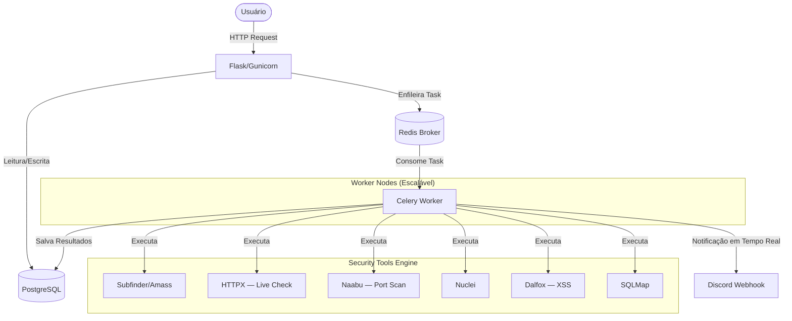

# BugBounty Monitor

> **Orquestrador de Segurança Ofensiva Automatizado**
>
> Uma plataforma robusta para gestão de reconhecimento (Recon) e análise de vulnerabilidades em escala, construída com arquitetura de microsserviços.


---

## Arquitetura do Sistema

O projeto utiliza uma arquitetura assíncrona para garantir que scans pesados não travem a interface do usuário.


```mermaid
graph TD
 User([Usuário]) -->|HTTP Request| Web[Flask/Gunicorn]
 Web -->|Leitura/Escrita| DB[(PostgreSQL)]
 Web -->|Enfileira Task| Redis[(Redis Broker)]

 subgraph "Worker Nodes (Escalável)"
 Worker[Celery Worker]
 end

 Redis -->|Consome Task| Worker
 Worker -->|Salva Resultados| DB

 subgraph "Security Tools Engine"
 Worker -->|Executa| Subfinder[Subfinder/Amass]
 Worker -->|Executa| HTTPX[HTTPX — Live Check]
 Worker -->|Executa| Naabu[Naabu — Port Scan]
 Worker -->|Executa| Nuclei[Nuclei]
 Worker -->|Executa| Dalfox[Dalfox — XSS]
 Worker -->|Executa| SQLMap[SQLMap]
 end

 Worker -->|Notificação em Tempo Real| Discord[Discord Webhook]
```

O Redis cumpre três papéis isolados por database number:

- **db 0** — Broker do Celery (fila de tasks)
- **db 1** — Cache (crt.sh, 30 dias) e mutex do dispatcher
- **db 2** — Storage do Flask-Limiter (contagem de rate-limit)

---

## Funcionalidades Principais

### Reconhecimento (Recon) Flexível

- **Modos de Operação:**
 - **`Baseline`** — Coleta subdomínios sem executar scan de vulnerabilidades.
 - **`Recon`** — Subfinder + Amass → HTTPX (live check) → Naabu (port scan nos hosts vivos).
 - **`Scan Vulns`** — Nuclei + Dalfox (XSS) + SQLMap nos alvos pendentes.
 - **`Full`** — Recon + Vuln Scan completo em sequência.
- **Live Check First:** O HTTPX roda **antes** do Naabu, que recebe apenas os hosts confirmados vivos — reduzindo em 10–40× o número de alvos do port scan.
- **Port Scan em Chunks:** O Naabu processa até 500 hosts por lote com timeout independente, evitando falhas em projetos com 8.000+ subdomínios. Configurável via `.env`.
- **Enriquecimento:** DNS (CNAME, MX), IPs e data de certificado SSL via `crt.sh` com **cache Redis de 30 dias**.
- **Status elegíveis para Vuln Scan:** `200, 201, 202, 204, 301, 302, 307, 308, 403` — o 403 é incluído porque painéis de admin/login frequentemente respondem com esse código.

### Vulnerability Scanning

- **Engine de Templates:** Nuclei (CVEs, Misconfigurations, Exposures).
- **Pipeline XSS:** `Katana` + `GAU` → `Dalfox`.
- **SQL Injection:** `Katana (qurl)` → `SQLMap`.
- **Smart Fuzzing:** `FFuf` (diretórios) + `CMSeeK` (CMS), configurável por projeto.
- **Dedup robusto:** Vulnerabilidades são deduplicadas por `(tool, severity, description)` — descrições iguais de ferramentas diferentes contam como achados distintos.
- **Apresentação de Resultados:** Cards por vulnerabilidade com parsing inteligente da saída das ferramentas — Nuclei exibe `Matcher` e URL clicável, SQLMap exibe parâmetro e payload, Dalfox exibe o payload XSS. Fallback `<pre>` para qualquer formato desconhecido.

### Controle de Scans

- **Fila Global com Concorrência Limitada:** No máximo `GLOBAL_SCAN_CONCURRENCY` projetos rodam ao mesmo tempo (padrão: **2**). Os demais aguardam em fila passiva e são despachados conforme os slots abrem.
- **Cap aplicado em todas as entradas:** `add_project`, `start_scan`, `start_scan_from_card` e `start_global_scan` passam por `_dispatch_or_queue` — não há porta de fuga.
- **`dispatch_next_pending()`:** Acorda o próximo projeto da fila passiva ao **liberar qualquer slot** — não só ao final de uma task bem-sucedida, mas também em parada manual (`stop_scan`, `stop_global_scan`) e exclusão de projeto (`delete_project`). Protegido por **mutex Redis** (`SET NX EX`, TTL 15s) compartilhado entre web e workers — elimina race condition de duplo despacho.
- **Stop Individual e Global:** O stop global revoga as tasks **apenas do usuário corrente** via `celery.control.revoke()`. Não usa `purge()`, que afetaria scans de outros usuários no mesmo broker.

### Interface & Gestão

- **Dashboard Interativo:** Aba "Visão Geral" com 5 cards: Superfície de Ataque (distribuição HTTP), Vulnerabilidades (barras de severidade), Projetos em Risco (ranking), Atividade Recente (tabela com status), Cobertura por Projeto (barra de progresso). Polling adaptativo: ~4–5s quando rodando, 60–120s quando parado.
- **Cards de Projeto:** Barra de cobertura de scan (hosts verificados/vivos), data do último scan com alerta de desatualização (3d amarelo, 7d vermelho), 4 botões de scan rápido (Baseline, Recon, Vulns, Full) diretamente no card, urgência proporcional no alerta de pendentes, distinção visual de estado por borda colorida.
- **Lista de Subdomínios:** Filtros rápidos pill (Todos, 2xx, 3xx, 4xx, Sem Status), ordenação clicável por coluna (nome, status, data), colunas Status e Portas separadas, badge de vulnerabilidades por domínio, badge Verificado/Pendente por linha, contador de resultados.
- **Vulnerabilidades:** Cards por vulnerabilidade com parsing inteligente da saída das ferramentas — Nuclei exibe Matcher e URL clicável, SQLMap exibe parâmetro e payload, Dalfox exibe o payload XSS. Summary bar com contagem por severidade no topo.
- **Exportação:** Download dos dados de cada projeto em **JSON** ou **CSV** diretamente pelo browser.
- **Histórico de Scans:** Aba por projeto com métricas de cada execução (modo, status, duração, novos domínios, hosts vivos, novas vulnerabilidades) e botão de **recarregar manual** para refletir scans recém-concluídos.
- **Busca Avançada com Paginação:** Filtros no estilo Discord + navegação entre páginas (cap de 500 por request).
- **Marcar como Verificado:** Botão para limpar manualmente o alerta de "alvos pendentes" em um projeto.

### Diferenciais de Engenharia

- **Gunicorn em Produção:** Substitui `flask run --debug` — mais estável, multi-worker.
- **Flask-Migrate:** Schema versionado via Alembic. Migrations aplicadas automaticamente no boot.
- **`ProxyFix` middleware:** Habilita `X-Forwarded-For` para que o rate-limit identifique o IP real do cliente em vez do IP do proxy — sem isso todos os usuários atrás de um reverse proxy compartilhariam o mesmo limite.
- **Rate Limiting no Login:** Máximo de 5 tentativas por minuto por IP (Flask-Limiter + Redis db 2).
- **CSRF Protection — global e abrangente:**
 - `WTF_CSRF_CHECK_DEFAULT = True` em toda rota POST.
 - Todas as forms `POST` carregam `{{ csrf_token() }}`.
 - Meta tag `csrf-token` em `base.html` + interceptors em `htmx:configRequest` e `window.fetch` enviam o header `X-CSRFToken` automaticamente em chamadas mutantes.
- **Validação de `target_url`:** Regex estrita (`^[a-z0-9](-?[a-z0-9])*(\.…)+$`) bloqueia entradas com caracteres shell-sensitive antes de chegarem ao banco e ao scanner.
- **Subdomain matching estrito:** `find_subdomains()` exige `cl == target` ou `cl.endswith('.' + target)` — evita falso positivo tipo `evilalvo.com` casando com `alvo.com`.
- **Sanitização em ponto único:** Todo input que vai para `shell=True` passa por `_sanitize_domain()` / `_sanitize_url()` em `scanner.py`.
- **Race Condition Corrigida:** `celery_uuid()` pré-gerado e salvo no banco **antes** do `apply_async`, garantindo que o worker sempre encontre o `task_id` correto.
- **Mutex Redis no Dispatcher:** `_acquire_dispatch_lock()` usa `SET NX EX` com **retry de até 5s** + TTL de 15s. Web e workers compartilham a mesma chave `dispatch_lock` — impede que dois processos despachem simultaneamente e ultrapassem o cap de concorrência.
- **FFuf com Timeout por Host:** Flags `-timeout`, `-maxtime` e `-maxtime-job` limitam o FFuf a no máximo `FFUF_MAXTIME` segundos por host (padrão: 90s), evitando travamentos em servidores lentos.
- **Worker Init Signal:** O Flask app é inicializado **uma única vez** por processo worker via `@worker_process_init.connect`, não a cada task. O signal também faz `engine.dispose()` para evitar herança de conexões SQLAlchemy do pai após o fork.
- **Task Auto-Healing tolerante:** Detecta scans "zumbis" comparando `current_task_id` com `inspect.active() + reserved() + scheduled()`. Usa timeout de 3s (1s perdia respostas legítimas do worker) e **período de graça de 30s** após `last_scan_date` — evita marcar como perdido enquanto o worker ainda está pegando a task da fila.
- **Reset no Startup:** Projetos com status `Rodando` ou `Na fila` de um boot anterior são resetados para `Parado` automaticamente, evitando que o auto-heal os marque como "Processo perdido" assim que o dashboard carrega.
- **Healthchecks Docker:** Todos os serviços (`db`, `redis`, `web`, `worker`) têm healthchecks configurados com `depends_on: condition: service_healthy`.
- **Tabelas Normalizadas:** `scan_history` (histórico de scans) e `port` (portas por domínio com `UniqueConstraint`) com índices compostos para queries rápidas.
- **Sem N+1 Queries:** Todas as rotas que exibem contadores usam `COUNT`/`SUM(CASE...)` SQL em vez de iterar relações SQLAlchemy em Python.

---

## Estrutura do Projeto

```text
BugBounty_Monitor/
├── app/
│ ├── static/ # Arquivos CSS/JS
│ ├── templates/
│ │ ├── partials/ # Fragmentos HTMX (controls, vulns, domains, etc.)
│ │ ├── base.html
│ │ ├── dashboard.html
│ │ ├── login.html
│ │ └── project.html
│ ├── models.py # Schema (User, Project, Domain, Port, Vulnerability, ScanHistory, SystemState)
│ ├── routes.py # Endpoints Flask + lógica de despacho de tasks
│ ├── scanner.py # Wrappers para ferramentas CLI (subfinder, httpx, naabu, nuclei…)
│ ├── services.py # Camada de serviços — queries SQL centralizadas
│ ├── tasks.py # Workers Celery (run_scan_task, run_daily_scan, dispatch_next_pending)
│ └── __init__.py # Factory da aplicação, Flask-Migrate, Limiter, CSRF, ProxyFix
├── migrations/ # Alembic migrations (versionadas no git)
├── docker-compose.yml # web + worker + beat + db + redis
├── Dockerfile # Imagem com todas as ferramentas Go instaladas
├── requirements.txt # Dependências Python
├── .env.example # Template de configuração
```

---

## Instalação e Configuração

### Pré-requisitos

- [Docker](https://docs.docker.com/get-docker/) e [Docker Compose](https://docs.docker.com/compose/install/)

### 1. Clonar o Repositório

```bash
git clone https://github.com/Sonael/BugBounty_Monitor.git
cd BugBounty_Monitor
```

### 2. Configurar Variáveis de Ambiente

```bash
cp .env.example .env
# Edite o .env com suas credenciais
```

**Variáveis essenciais (obrigatórias):**

| Variável | Descrição | Exemplo |
|---|---|---|
| `POSTGRES_USER` | Usuário do banco | `user` |
| `POSTGRES_PASSWORD` | Senha do banco | `senha_forte` |
| `POSTGRES_DB` | Nome do banco | `bugbounty` |
| `DATABASE_URL` | String de conexão SQLAlchemy | `postgresql://user:senha@db:5432/bugbounty` |
| `CELERY_BROKER_URL` | Redis broker (db=0) | `redis://redis:6379/0` |
| `SECRET_KEY` | Chave de sessão Flask (64 chars hex) | `python -c "import secrets; print(secrets.token_hex(32))"` |
| `ADMIN_USER` | Username do admin | `admin` |
| `ADMIN_PASSWORD` | Senha do admin (**sem fallback hardcoded**) | `senha_muito_forte` |

> Se `SECRET_KEY` ou `ADMIN_PASSWORD` não estiverem definidas, a aplicação **recusa iniciar**.

**Variáveis opcionais (com defaults sensatos):**

| Variável | Default | Descrição |
|---|---|---|
| `REDIS_HOST` | `redis` | Host Redis (usado para cache + mutex) |
| `POSTGRES_HOST` | `db` | Host do Postgres |
| `POSTGRES_PORT` | `5432` | Porta do Postgres |
| `SESSION_DAYS` | `30` | Duração do cookie "lembre-me" em dias |
| `GLOBAL_SCAN_CONCURRENCY` | `2` | Máximo de scans simultâneos no sistema |
| `DISCORD_WEBHOOK_URL` | — | Webhook para alertas em tempo real |
| `SUBFINDER_THREADS` | `100` | Threads do Subfinder |
| `AMASS_TIMEOUT` | `29` | Timeout do Amass (minutos) |
| `HTTPX_THREADS` | `50` | Threads do HTTPX |
| `NAABU_CHUNK_SIZE` | `500` | Hosts por lote no Naabu |
| `NAABU_CHUNK_TIMEOUT` | `600` | Timeout por lote (segundos) |
| `NAABU_RATE` | `1000` | Pacotes/s do Naabu |
| `NAABU_TOP_PORTS` | `100` | Top-N portas escaneadas |
| `NAABU_RETRIES` | `1` | Retries por pacote |
| `NAABU_PKT_TIMEOUT` | `5` | Timeout de pacote (segundos) |
| `NUCLEI_TAGS` | `cve,misconfig,exposure,…` | Tags do Nuclei |
| `NUCLEI_SEVERITY` | `low,medium,high,critical` | Severidades |
| `NUCLEI_CONCURRENCY` | `50` | Workers do Nuclei |
| `NUCLEI_TIMEOUT` | `10` | Timeout por template (segundos) |
| `NUCLEI_RETRIES` | `2` | Retries do Nuclei |
| `KATANA_DEPTH` | `3` | Profundidade do crawler |
| `DALFOX_TIMEOUT` | `10` | Timeout do Dalfox (segundos) |
| `SQLMAP_RISK` | `2` | Risk do SQLMap (1–3) |
| `SQLMAP_LEVEL` | `3` | Level do SQLMap (1–5) |
| `SQLMAP_THREADS` | `4` | Threads do SQLMap |
| `FFUF_MAXTIME` | `90` | Tempo máximo por host (segundos) |
| `GAU_BLACKLIST` | `png,jpg,…` | Extensões ignoradas pelo GAU |

### 3. Subir todos os serviços

```bash
docker compose up -d --build
```

> Na primeira vez o build demora alguns minutos — o Docker instala ferramentas Go (Nuclei, Naabu, Subfinder, etc.) e atualiza os templates do Nuclei. As migrations já estão versionadas em `migrations/versions/` e são aplicadas automaticamente no boot via `flask db upgrade` (executado no comando do serviço `web`).

### 4. Acessar

Abra o navegador em: **http://localhost:5000**

Login com as credenciais definidas em `ADMIN_USER` / `ADMIN_PASSWORD`.

---

## Banco de Dados

### Tabelas

| Tabela | Descrição |
|---|---|
| `user` | Usuários da plataforma |
| `project` | Projetos de bug bounty |
| `domain` | Subdomínios descobertos (com índices compostos) |
| `port` | Portas abertas por domínio (normalizada, `UNIQUE domain_id + port_number`) |
| `vulnerability` | Vulnerabilidades encontradas |
| `scan_history` | Registro de cada execução de scan com métricas |
| `system_state` | Estado do agendador (controle do scan diário) |

### Migrations

```bash
# Após alterar models.py
docker compose run --rm web flask db migrate -m "descrição da mudança"
docker compose run --rm web flask db upgrade
git add migrations/ && git commit -m "chore: migration ..."
```

---

## API Endpoints

| Método | Rota | Descrição |
|---|---|---|
| `GET` | `/project/<id>/export/json` | Exporta todos os dados do projeto em JSON |
| `GET` | `/project/<id>/export/csv` | Exporta todos os dados do projeto em CSV |
| `GET` | `/api/project/<id>/history` | Retorna histórico de scans (últimos 30) |
| `GET` | `/api/project/<id>/search_options` | Valores únicos para autocomplete da busca |
| `GET` | `/api/heal_projects` | Auto-healing de scans órfãos (badge do header) |
| `POST` | `/project/<id>/mark_scanned` | Marca todos os domínios como verificados |
| `POST` | `/project/<id>/scan/<mode>` | Inicia scan (`baseline`, `recon`, `vuln`, `full`) |
| `POST` | `/project/<id>/scan_card/<mode>` | Inicia scan pelo card do dashboard e retorna o card atualizado |
| `POST` | `/project/<id>/stop` | Para o scan ativo do projeto (também remove da fila passiva) |
| `POST` | `/scan/global/start` | Inicia scan em todos os projetos (respeitando `GLOBAL_SCAN_CONCURRENCY`) |
| `POST` | `/scan/global/stop` | Revoga todos os scans **do usuário corrente** (não usa `purge` global) |

> O token CSRF é injetado automaticamente via meta tag em `base.html` e enviado em todas as requisições HTMX e `fetch` mutantes — não há endpoint separado para obtê-lo.

---

## Guia de Filtros Avançados

A busca de subdomínios usa uma sintaxe no estilo Discord que suporta lógica AND/OR.

### Lógica

| Separador | Comportamento | Exemplo |
|---|---|---|
| **Espaço** entre blocos | **AND** — todos os blocos devem ser satisfeitos | `tech:nginx status:200` |
| **Vírgula** em `status:` e `subdominio:` | **OR** — qualquer valor | `status:200,403` |
| **Vírgula** em `tech:`, `portas:`, `path:` | **AND** — todos os valores obrigatórios | `tech:PHP,Laravel` |

### Filtros Disponíveis

| Chave | Lógica da vírgula | Exemplo |
|---|---|---|
| `status:` | OR | `status:200,403` |
| `subdominio:` | OR | `subdominio:api,dev` |
| `tech:` | AND | `tech:PHP,Laravel` |
| `portas:` | AND | `portas:80,443` |
| `path:` | AND | `path:/.git,/admin` |
| `date:` | intervalo | `date:2024-01-01 to 2024-03-31` |
| `ssl:` | intervalo | `ssl:2023-01-01 to 2023-12-31` |

### Exemplos de Combinação

```text
# Painéis admin vivos com WordPress
subdominio:admin status:200 tech:WordPress

# Servidores Nginx com possível vazamento de Git
tech:nginx path:/.git

# Stack Node + Express em porta alternativa
tech:Node,Express portas:3000

# Subdomínios descobertos em janeiro/2024
date:2024-01-01 to 2024-01-31
```

> Texto sem chave (ex: `login`) faz busca livre no nome do domínio e nas tecnologias.

---

## Notificações Discord

O sistema envia notificações em três momentos:

1. **Durante o scan** — ao descobrir novos subdomínios vivos (tempo real, não espera o scan terminar).
2. **Ao finalizar o Recon** — resumo com totais por status HTTP e novos domínios.
3. **Ao finalizar o Vuln Scan** — total de vulnerabilidades por ferramenta, ou confirmação de "scan limpo".

Configure `DISCORD_WEBHOOK_URL` no `.env` para ativar.

---

## Serviços Docker

| Serviço | Imagem | Função |
|---|---|---|
| `web` | Custom (Gunicorn) | API Flask + serve o frontend |
| `worker` | Custom (Celery) | Executa os scans (concurrency=2) |
| `beat` | Custom (Celery Beat) | Agenda o scan diário às 03:00 |
| `db` | `postgres:13-alpine` | Banco de dados principal |
| `redis` | `redis:6-alpine` | Broker de tasks + cache + mutex de despacho |

Todos os serviços têm `restart: unless-stopped` e healthchecks configurados.

---

<div align="center">
Desenvolvido por <a href="https://github.com/Sonael">Sonael</a>
</div>
