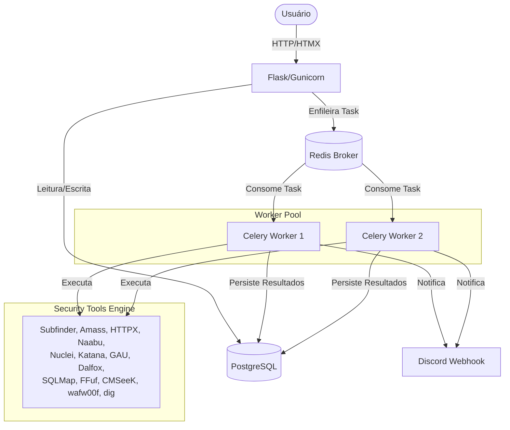
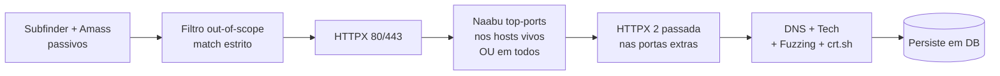
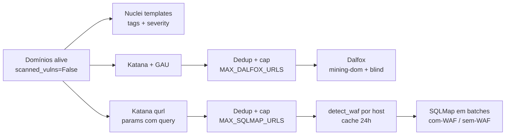

# BugBounty Monitor

> Orquestrador de segurança ofensiva automatizado para gestão de reconhecimento (Recon) e análise de vulnerabilidades em escala, construído sobre uma arquitetura assíncrona de microsserviços.


---

## Visão Geral

O BugBounty Monitor é uma plataforma operada via dashboard web que executa pipelines de descoberta de superfície de ataque e análise de vulnerabilidades de forma assíncrona. A interface HTTP serve apenas como camada de controle: todo o trabalho pesado (coleta de subdomínios, port scan, fuzzing, análise estática e dinâmica) acontece em workers Celery isolados, com persistência em PostgreSQL.

O sistema foi desenhado com três premissas operacionais:

1. **Escalabilidade horizontal**. Workers Celery são stateless e podem ser replicados. A fila Redis e o banco PostgreSQL são os únicos pontos de coordenação.
2. **Determinismo do despacho**. Concorrência global limitada via mutex Redis. Não há condição de corrida entre múltiplos workers ou requisições HTTP simultâneas.
3. **Resiliência operacional**. Tasks órfãs após reinicialização são resetadas no boot. Scans zumbis (workers mortos sem cleanup) são detectados pelo módulo de auto-heal.

---

## Arquitetura do Sistema


```mermaid
graph TD
 User([Usuário]) -->|HTTP/HTMX| Web[Flask/Gunicorn]
 Web -->|Leitura/Escrita| DB[(PostgreSQL)]
 Web -->|Enfileira Task| Redis[(Redis Broker)]

 subgraph "Worker Pool"
 Worker1[Celery Worker 1]
 Worker2[Celery Worker 2]
 end

 Redis -->|Consome Task| Worker1
 Redis -->|Consome Task| Worker2
 Worker1 -->|Persiste Resultados| DB
 Worker2 -->|Persiste Resultados| DB

 subgraph "Security Tools Engine"
 Tools[Subfinder, Amass, HTTPX, Naabu,<br/>Nuclei, Katana, GAU, Dalfox,<br/>SQLMap, FFuf, CMSeeK, wafw00f, dig]
 end

 Worker1 -->|Executa| Tools
 Worker2 -->|Executa| Tools

 Worker1 -->|Notifica| Discord[Discord Webhook]
 Worker2 -->|Notifica| Discord
```

### Papéis do Redis

O Redis cumpre três funções isoladas por database number:

| DB | Função | TTL |
|---|---|---|
| `0` | Broker do Celery (fila de tasks e backend de resultados) | Determinado pelo Celery |
| `1` | Cache da aplicação: `crt.sh` (30 dias), detecção de WAF (24h), mutex `dispatch_lock` (15s) | Por chave |
| `2` | Storage do Flask-Limiter (contagem de rate-limit por IP) | Janela de 1 min |

### Stack tecnológica

- **Web layer**: Flask 2.x servido por Gunicorn (2 workers sync, timeout 300s). HTMX no front-end para atualização parcial sem SPA.
- **Workers**: Celery 5 com pool `prefork` (2 processos), `prefetch-multiplier=1` e `max-tasks-per-child=50` (evita acúmulo de memória em scans longos).
- **Agendador**: Celery Beat com scheduler persistente (`celery.beat:PersistentScheduler`).
- **ORM**: SQLAlchemy 1.4 com Flask-SQLAlchemy. Migrations versionadas via Flask-Migrate (Alembic).
- **Segurança**: Flask-WTF (CSRF), Flask-Limiter (rate-limit), Flask-Login (sessões persistentes), Werkzeug ProxyFix.

---

## Pipeline de Execução

O scan de um projeto é uma máquina de estados executada pela task `run_scan_task` em `app/tasks.py`. O comportamento depende do modo selecionado (`baseline`, `recon`, `vuln`, `full`).

### Fase 1: Recon


```mermaid
graph LR
 Subs[Subfinder + Amass<br/>passivos] --> Filter[Filtro out-of-scope<br/>match estrito]
 Filter --> HTTPX1[HTTPX 80/443]
 HTTPX1 --> Naabu[Naabu top-ports<br/>nos hosts vivos<br/>OU em todos]
 Naabu --> HTTPX2[HTTPX 2 passada<br/>nas portas extras]
 HTTPX2 --> Process[DNS + Tech<br/>+ Fuzzing + crt.sh]
 Process --> DB[(Persiste em DB)]
```

**Detalhamento das etapas:**

1. **Coleta de subdomínios (Subfinder + Amass)**. Apenas fontes passivas (`-passive` no Amass, modo padrão do Subfinder). API keys opcionais elevam a cobertura — sem elas, apenas providers públicos (crt.sh, AlienVault OTX, Wayback, HackerTarget) são consultados.

2. **Filtro de escopo**. Aplica blacklist `out_of_scope` (com suporte a wildcards via `fnmatch`) e match estrito contra o domínio raiz para evitar falsos positivos como `evilalvo.com` casando com `alvo.com`. A correspondência exige `cl == target` ou `cl.endswith('.' + target)`.

3. **HTTPX inicial (portas 80/443)**. Confirma quais hosts respondem em HTTP/HTTPS padrão. Coleta status, tecnologias detectadas via Wappalyzer (`-td`), IPs (`-ip`), follow-redirects (`-fr`) e info de certificado TLS (`-tls-grab`). Rate-limited via `HTTPX_RATE_LIMIT`.

4. **Naabu (port scan)**. Por padrão escaneia apenas os hosts confirmados vivos pelo HTTPX, em chunks configuráveis (`NAABU_CHUNK_SIZE`). Pula IPs de CDN conhecidas (`-exclude-cdn`) para não desperdiçar tempo em infraestrutura compartilhada.

   Com `NAABU_FULL_SWEEP=true`, o Naabu escaneia **todos** os subdomínios coletados, não apenas os alive. Captura hosts que respondem exclusivamente em portas alternativas (`:8080`, `:8443`, `:3000`, etc.) ao custo de aproximadamente 5 a 10 vezes mais tempo de scan.

5. **HTTPX segunda passada**. Para cada host onde o Naabu descobriu portas além de 80/443, executa o HTTPX novamente com `-ports 80,443,<portas_descobertas>`. Sem essa passada, painéis de administração rodando apenas em portas alternativas ficariam invisíveis.

6. **Processamento por domínio**. Para cada host vivo: enriquecimento DNS (CNAME, MX via `dig`), data do certificado mais antigo via `crt.sh` (com cache Redis de 30 dias), fuzzing de diretórios (FFuf) e detecção de CMS (CMSeeK) — esta última sujeita ao threshold `CMSEEK_MAX_HOSTS`.

### Fase 2: Vuln Scan


```mermaid
graph LR
 Targets[Domínios alive<br/>scanned_vulns=False] --> Nuclei[Nuclei templates<br/>tags + severity]
 Targets --> Crawl[Katana + GAU]
 Crawl --> Dedup1[Dedup + cap<br/>MAX_DALFOX_URLS]
 Dedup1 --> Dalfox[Dalfox<br/>mining-dom + blind]
 Targets --> KatanaQ[Katana qurl<br/>params com query]
 KatanaQ --> Dedup2[Dedup + cap<br/>MAX_SQLMAP_URLS]
 Dedup2 --> WAFDetect[detect_waf por host<br/>cache 24h]
 WAFDetect --> SQLMap[SQLMap em batches<br/>com-WAF / sem-WAF]
```

**Detalhamento das etapas:**

1. **Seleção de alvos**. Filtra domínios com `status_code IN (200, 201, 202, 204, 301, 302, 307, 308, 403)` e `scanned_vulns=False`. O código 403 está incluído porque painéis de administração frequentemente respondem com esse status.

2. **Nuclei**. Engine de templates. Tags e severidades configuráveis. Quando a tag `fuzzing` está presente, a flag `-dast` é adicionada automaticamente (sem ela, templates DAST são silenciosamente ignorados). Rate-limit global via `-rl` evita rajadas que disparam WAF/IDS. Templates OAST funcionam adequadamente apenas quando `INTERACTSH_URL` aponta para um servidor Interactsh próprio.

3. **Pipeline XSS (Katana + GAU → Dalfox)**. Katana faz crawling (JS crawl ativado, sitemap, robots.txt) com dedup de query strings (`-iqp`). GAU complementa com URLs históricas de Wayback/CommonCrawl, recebendo apenas domínios sem prefixo `https://`. As URLs combinadas passam por `sort -u` e cap configurável (`MAX_DALFOX_URLS`, default 10000) antes do Dalfox, que roda com `--mining-dom` e `--blind` (se `DALFOX_BLIND_URL` ou `INTERACTSH_URL` estiver setado).

4. **Pipeline SQLi (Katana qurl → SQLMap em batches)**. Katana com filtro `-f qurl` extrai apenas URLs com query strings. Dedup e cap (`MAX_SQLMAP_URLS`, default 5000) aplicados.

   O SQLMap roda em **dois batches separados** baseado em detecção WAF por host:
   - **Batch com WAF**: aplica `--tamper=between,randomcase,space2comment` e `--delay=1` (ou o `SQLMAP_TAMPER`/`SQLMAP_DELAY` configurado manualmente).
   - **Batch sem WAF**: roda raw, mais rápido.

   A técnica padrão é `BEU` (Boolean-based, Error-based, Union-based) — `T` (time-based) é omitido por ser extremamente lento em listas grandes. `--time-sec` configurável para quando time-based é desejado.

### Modos de Scan

| Modo | Fase Recon | Fase Vuln | Uso típico |
|---|---|---|---|
| `baseline` | Sim | Apenas se `vuln_scan_enabled=true` no projeto | Primeiro registro de um projeto novo |
| `recon` | Sim | Não | Atualização diária da superfície de ataque |
| `vuln` | Não | Sim | Re-scan focado em vulns nos alvos já catalogados |
| `full` | Sim | Apenas se `vuln_scan_recon_enabled=true` no projeto | Recon + vuln em sequência (varredura completa) |

---

## Detecção de WAF

A função `detect_waf` em `app/scanner.py` invoca o `wafw00f` contra uma URL e parseia o stdout. O resultado é cacheado em Redis (db 1) por 24 horas para evitar custo repetido.

A função `detect_waf_bulk` agrupa hosts e limita o número de chamadas novas a `wafw00f` por scan (`max_checks=20` por padrão). Hosts além do limite que não estão no cache são tratados como "sem WAF" (best-effort).

No pipeline SQLi, a detecção é per-host: o conjunto de URLs é separado em dois arquivos baseado no WAF do host de cada URL, e o SQLMap é executado uma vez para cada arquivo com flags adequadas. Isso evita dois problemas opostos:

- Aplicar tamper desnecessário em hosts sem WAF (lentidão sem ganho).
- Rodar sem tamper em hosts com WAF (queima de IP, payloads filtrados).

---

## Controle de Concorrência

### Fila global

A constante `GLOBAL_SCAN_CONCURRENCY` (padrão `2`) define o número máximo de scans rodando simultaneamente no sistema inteiro — somando todos os usuários.

Quando uma rota inicia um scan e o limite global está atingido, o projeto vai para uma **fila passiva** (`scan_status='Na fila'` com `current_task_id=None`). Quando um slot abre, a função `dispatch_next_pending` despacha o próximo projeto da fila.

### Mutex de despacho

A função `_acquire_dispatch_lock` em `app/routes.py` (e a versão em `app/tasks.py`) usa `SET NX EX` no Redis com TTL de 15 segundos. A versão da web tem retry com backoff (até 5 segundos esperando o lock).

Web e workers compartilham a mesma chave `dispatch_lock`. Isso elimina a condição de corrida clássica: dois processos contando "slots livres" simultaneamente, ambos decidindo despachar, e o limite sendo ultrapassado.

### Pontos que acordam a fila

`dispatch_next_pending` é chamado em **todos** os pontos que liberam um slot:

- Final de `run_scan_task` (sucesso, erro ou recon-only completo)
- `stop_scan` (parada manual de um projeto)
- `stop_global_scan` (parada global)
- `delete_project` (exclusão de projeto com scan ativo)

Adicionalmente, ao iniciar a aplicação, `reset_orphaned_scans` reseta todos os projetos com `scan_status` em `Rodando` ou `Na fila` para `Parado`. Sem isso, o auto-heal marcaria todos como `Erro: Processo perdido` no primeiro polling após o boot.

### Auto-heal

A rota `/api/heal_projects` (chamada periodicamente pelo header do dashboard) detecta scans cujo `current_task_id` não aparece em `inspect.active() + inspect.reserved() + inspect.scheduled()` do Celery. O timeout do inspector é 3 segundos (1 segundo perde respostas válidas em sistemas com carga). Um período de graça de 30 segundos após `last_scan_date` evita marcar como perdido enquanto o worker ainda está pegando a task da fila.

---

## Segurança

### Sanitização de Input

Todo input que chega ao shell passa por validação em ponto único:

- `_sanitize_domain` em `app/scanner.py`: regex `^[a-zA-Z0-9.\-]+$` aplicada após strip de scheme/path/porta. Lança `ValueError` em caracteres inválidos.
- `_sanitize_url`: exige scheme `http://` ou `https://`, valida o netloc com a mesma regex.
- `_clean_target_url` em `app/routes.py`: regex de domínio FQDN (`r'^[a-zA-Z0-9](?:[a-zA-Z0-9-]{0,62}[a-zA-Z0-9])?(?:\.…)+$'`) bloqueia entradas malformadas antes de chegarem ao banco.

`shell=True` é mantido em `run_command` porque vários comandos usam pipes e redirects. A segurança vem do contrato: nenhuma string entra ali sem ter passado por sanitização.

### CSRF

`WTF_CSRF_CHECK_DEFAULT = True` aplica validação a toda rota POST. A stack de injeção do token:

- Todas as forms POST nos templates carregam `<input type="hidden" name="csrf_token" value="{{ csrf_token() }}">`.
- Meta tag `<meta name="csrf-token">` em `base.html`.
- Interceptor `htmx:configRequest` injeta o header `X-CSRFToken` em toda requisição HTMX.
- Wrapper sobre `window.fetch` injeta o mesmo header em chamadas mutantes (`POST`, `PUT`, `PATCH`, `DELETE`).

### XSS armazenado

Vulnerabilidades em popovers Bootstrap (usados em colunas como "Tecnologias" e "Portas" na lista de domínios) foram corrigidas habilitando `sanitize: true` no Bootstrap Popover. Sem isso, uma string controlada por um servidor HTTP malicioso (ex: header `Server: `) podia executar JavaScript no dashboard.

### Rate Limit

`Flask-Limiter` com storage em Redis (db 2) aplica `5 per minute` por IP na rota `/login`. O middleware `ProxyFix` faz com que o `X-Forwarded-For` seja respeitado — sem ele, todos os clientes atrás de um reverse proxy compartilhariam o mesmo IP e a aplicação inteira seria bloqueada após poucos logins falhos.

### Race Condition de despacho

Ao criar um projeto via `/add_project`, o `task_id` é gerado via `celery_uuid()` e persistido no banco **antes** do `apply_async`. Sem essa ordenação, o worker poderia consumir a task antes do commit, a verificação de "duplicata" disparar e a task ser descartada silenciosamente.

---

## Interface

### Dashboard

A página `/dashboard` apresenta cinco cards principais na aba "Visão Geral":

- **Superfície de Ataque**: distribuição HTTP (2xx/3xx/4xx/5xx), total de domínios, projetos, pendentes de scan, scans ativos.
- **Vulnerabilidades**: barras de severidade (crítico, alto, médio, baixo/info) com percentuais.
- **Projetos em Risco**: ranking dos 5 projetos com mais vulnerabilidades.
- **Subdomínios Recentes**: tabela com os 5 últimos domínios descobertos.
- **Cobertura por Projeto**: barra de progresso por projeto (hosts verificados/hosts vivos).

### Polling adaptativo via HTMX

O polling de cada componente é configurado com intervalos diferentes conforme o estado:

| Componente | Estado ativo | Estado parado |
|---|---|---|
| Card do projeto (dashboard) | 5 segundos | 120 segundos |
| Status card (página do projeto) | 4 segundos | 120 segundos |
| Controles de scan | 4 segundos | 60 segundos |
| Lista de domínios | 5 segundos | 5 segundos (pausável) |
| Stats globais | 10 segundos | 10 segundos |
| Header system-status | 8 segundos | 8 segundos |

O polling da lista de domínios pode ser pausado via `window.pausePolling = true` quando o usuário está interagindo com a tabela (scroll, hover, popover aberto).

### Busca de subdomínios

Sintaxe estilo Discord, com suporte a operadores AND/OR mistos:

| Separador | Comportamento |
|---|---|
| Espaço entre blocos | AND — todos os blocos devem satisfazer |
| Vírgula em `status:` e `subdominio:` | OR — qualquer valor casa |
| Vírgula em `tech:`, `portas:`, `path:` | AND — todos os valores são obrigatórios |

Chaves disponíveis: `status:`, `subdominio:`, `tech:`, `portas:`, `path:`, `date:` (intervalo), `ssl:` (intervalo). Texto sem chave faz busca livre em nome e tecnologias.

### Histórico de scans

A aba "Histórico" em cada projeto consulta `/api/project/<id>/history` e exibe os últimos 30 registros com modo, status, duração, novos domínios, hosts vivos e novas vulnerabilidades. Inclui botão de recarregar manual para refletir scans concluídos durante a navegação.

### Exportação

`/project/<id>/export/json` e `/project/<id>/export/csv` exportam todos os domínios e vulnerabilidades do projeto. JSON preserva estrutura completa; CSV inclui colunas agregadas (Vuln Count, Highest Severity).

---

## Banco de Dados

### Tabelas

| Tabela | Conteúdo |
|---|---|
| `user` | Usuários da plataforma (admin/operadores) |
| `project` | Projetos de bug-bounty (alvo, configuração, estado do scan) |
| `domain` | Subdomínios descobertos com índices compostos por `project_id+status_code`, `project_id+first_seen`, `project_id+scanned_vulns` |
| `port` | Portas abertas normalizadas (`UNIQUE(domain_id, port_number)`) |
| `vulnerability` | Vulnerabilidades detectadas (tool, severity, description, domain_id) |
| `scan_history` | Registro imutável de cada execução com métricas e duração |
| `system_state` | Estado do agendador (idempotência do scan diário) |

### Performance de queries

- **Sem N+1**: rotas que exibem contadores usam `COUNT` ou `SUM(CASE ...)` SQL diretamente, sem iterar relações SQLAlchemy em Python.
- **Vulnerabilidades**: query direta com `JOIN` em `Vulnerability + Domain`, ordenada por severidade via `CASE WHEN`.
- **Stats agregados**: função `get_all_projects_card_stats(project_ids)` calcula 2xx/3xx/4xx/5xx, totais, vulns e pendentes em **2 queries** para qualquer número de projetos.

### Deduplicação de vulnerabilidades

`process_vulns` em `app/tasks.py` deduplica por `(tool, severity, description)`. Descrições idênticas de ferramentas distintas (ex: Nuclei vs SQLMap reportando a mesma URL) são tratadas como achados distintos.

### Migrations

```bash
docker compose run --rm web flask db migrate -m "descrição da mudança"
docker compose run --rm web flask db upgrade
git add migrations/ && git commit -m "chore: migration ..."
```

Migrations são aplicadas automaticamente no boot pelo serviço `web` (comando `flask db upgrade`).

---

## Instalação

### Pré-requisitos

- [Docker](https://docs.docker.com/get-docker/) e [Docker Compose](https://docs.docker.com/compose/install/)

### 1. Clonar o repositório

```bash
git clone https://github.com/Sonael/BugBounty_Monitor.git
cd BugBounty_Monitor
```

### 2. Configurar variáveis de ambiente

```bash
cp .env.example .env
```

Edite o `.env` preenchendo no mínimo as variáveis obrigatórias (próxima seção).

### 3. Subir os serviços

```bash
docker compose up -d --build
```

A primeira execução demora alguns minutos pois o Dockerfile baixa e instala todas as ferramentas Go (Subfinder, HTTPX, Naabu, Nuclei, Katana, Dalfox, GAU, FFuf, Amass), wordlists do SecLists, CMSeeK, SQLMap, `wafw00f` e atualiza os templates do Nuclei.

### 4. Acessar

http://localhost:5000

Login com as credenciais definidas em `ADMIN_USER` / `ADMIN_PASSWORD`.

---

## Variáveis de Ambiente

### Obrigatórias

| Variável | Descrição |
|---|---|
| `POSTGRES_USER` / `POSTGRES_PASSWORD` / `POSTGRES_DB` | Credenciais do banco |
| `DATABASE_URL` | String de conexão SQLAlchemy (deve refletir as credenciais acima) |
| `CELERY_BROKER_URL` | Endpoint do Redis broker. Padrão: `redis://redis:6379/0` |
| `SECRET_KEY` | Chave de sessão Flask. Gere com `python -c "import secrets; print(secrets.token_hex(32))"` |
| `ADMIN_USER` / `ADMIN_PASSWORD` | Credenciais do admin (criado automaticamente no primeiro boot). Sem fallback hardcoded — se não definidas, a aplicação recusa iniciar. |

### Operacionais

| Variável | Default | Descrição |
|---|---|---|
| `GLOBAL_SCAN_CONCURRENCY` | `2` | Máximo de scans simultâneos no sistema inteiro |
| `SESSION_DAYS` | `30` | Duração do cookie de sessão "lembre-me" |
| `REDIS_HOST` | `redis` | Host Redis para cache e mutex |
| `POSTGRES_HOST` / `POSTGRES_PORT` | `db` / `5432` | Endpoint do PostgreSQL |
| `INTERACTSH_URL` | (vazio) | Servidor Interactsh próprio para OAST (recomendado para uso sério) |
| `DISCORD_WEBHOOK_URL` | (vazio) | Webhook para notificações em tempo real |

### Subfinder e Amass (recon passivo)

| Variável | Default | Descrição |
|---|---|---|
| `SUBFINDER_THREADS` | `100` | Concorrência interna do Subfinder |
| `AMASS_TIMEOUT` | `29` | Timeout do Amass em **MINUTOS** (não segundos — Amass v4 usa minutos) |

### HTTPX

| Variável | Default | Descrição |
|---|---|---|
| `HTTPX_THREADS` | `50` | Threads de conexão |
| `HTTPX_RATE_LIMIT` | `150` | Limite global de requisições por segundo |

### Naabu (port scan)

| Variável | Default | Descrição |
|---|---|---|
| `NAABU_CHUNK_SIZE` | `500` | Hosts por lote (chunking para projetos com 8000+ hosts) |
| `NAABU_CHUNK_TIMEOUT` | `600` | Timeout por lote em segundos |
| `NAABU_RATE` | `1000` | Pacotes por segundo |
| `NAABU_TOP_PORTS` | `100` | Top-N portas escaneadas (Naabu mantém lista interna) |
| `NAABU_RETRIES` | `1` | Retries por pacote |
| `NAABU_PKT_TIMEOUT` | `5` | Timeout por pacote em segundos |
| `NAABU_EXCLUDE_CDN` | `true` | Pula IPs de CDN conhecidas (Cloudflare, Akamai, Fastly) |
| `NAABU_FULL_SWEEP` | `false` | Quando `true`, escaneia portas em todos os subdomínios — não só os alive em 80/443. Captura admin panels em portas alternativas ao custo de 5 a 10x mais tempo. |

### Nuclei

| Variável | Default | Descrição |
|---|---|---|
| `NUCLEI_TAGS` | `cve,misconfig,exposure,tech,panel,xss,sqli,lfi,ssrf,rce,oast,takeover,default-login,fuzzing` | Tags de templates ativadas |
| `NUCLEI_SEVERITY` | `info,low,medium,high,critical` | Severidades aceitas (info inclui detecção de versão, takeover indicators) |
| `NUCLEI_CONCURRENCY` | `50` | Templates concorrentes |
| `NUCLEI_TIMEOUT` | `10` | Timeout por template em segundos |
| `NUCLEI_RETRIES` | `2` | Retries por finding |
| `NUCLEI_RATE_LIMIT` | `150` | Rate-limit global em req/s |

Quando `NUCLEI_TAGS` contém `fuzzing`, a flag `-dast` é adicionada automaticamente (templates DAST exigem essa flag para serem ativados). Quando `INTERACTSH_URL` está setada, é passada via `-interactsh-url` (templates OAST funcionam corretamente).

### Katana

| Variável | Default | Descrição |
|---|---|---|
| `KATANA_DEPTH` | `3` | Profundidade do crawler |
| `KATANA_IGNORE_QUERY` | `true` | Aplica `-iqp` para deduplicar URLs com query strings diferentes |

### Dalfox

| Variável | Default | Descrição |
|---|---|---|
| `DALFOX_TIMEOUT` | `10` | Timeout por requisição em segundos |
| `DALFOX_BLIND_URL` | (= `INTERACTSH_URL`) | Callback URL para blind XSS |

`--mining-dom` é sempre ativado.

### SQLMap

| Variável | Default | Descrição |
|---|---|---|
| `SQLMAP_RISK` | `2` | Nível de risco (1-3) |
| `SQLMAP_LEVEL` | `3` | Nível de teste (1-5) |
| `SQLMAP_THREADS` | `4` | Threads concorrentes |
| `SQLMAP_TECHNIQUE` | `BEU` | Técnicas (B=Boolean, E=Error, U=Union, S=Stacked, T=Time, Q=Inline). `T` excluído por ser muito lento em listas grandes. |
| `SQLMAP_TIME_SEC` | `10` | Timeout para técnicas time-based (se `T` for adicionado) |
| `SQLMAP_TAMPER` | (vazio) | Tamper scripts manuais. Vazio = aplicação automática quando WAF detectado |
| `SQLMAP_DELAY` | `0` | Delay entre requests em segundos |

### FFuf (fuzzing de diretórios)

| Variável | Default | Descrição |
|---|---|---|
| `FFUF_MAXTIME` | `90` | Tempo máximo por host em segundos |
| `FFUF_WORDLIST` | `/opt/wordlists/raft-medium-directories.txt` | Wordlist usada. Fallback automático para `common.txt` se a wordlist não existir |
| `FFUF_RECURSION` | `1` | Profundidade de recursão (0 = sem recursão) |

### GAU

| Variável | Default | Descrição |
|---|---|---|
| `GAU_BLACKLIST` | `png,jpg,jpeg,gif,css,svg,woff,woff2,ico,ttf,eot` | Extensões ignoradas |

### CMSeeK

| Variável | Default | Descrição |
|---|---|---|
| `CMSEEK_MAX_HOSTS` | `50` | Threshold de hosts vivos. Acima disso, CMSeeK é pulado no scan inteiro (não tem modo batch — escala mal). |

### Caps de URLs

| Variável | Default | Descrição |
|---|---|---|
| `MAX_DALFOX_URLS` | `10000` | Após dedup, trunca para no máximo N URLs antes do Dalfox |
| `MAX_SQLMAP_URLS` | `5000` | Após dedup, trunca para no máximo N URLs antes do SQLMap |

---

## API Keys (Subfinder e Amass)

A diferença de cobertura com vs sem API keys é considerável — providers premium (SecurityTrails, Shodan, Censys, GitHub) frequentemente indexam subdomínios que crt.sh e Wayback não têm.

### Configuração

Os arquivos `configs/subfinder.yaml` e `configs/amass.ini` são montados como volumes read-only no serviço `worker` do Docker Compose. Os templates incluídos no repositório contêm exemplos comentados para cada provider suportado.

**Subfinder** (`configs/subfinder.yaml`):

```yaml
shodan:
  - SHODAN_API_KEY
securitytrails:
  - SECURITYTRAILS_API_KEY
github:
  - GITHUB_TOKEN
chaos:
  - CHAOS_API_KEY
virustotal:
  - VIRUSTOTAL_API_KEY
```

**Amass** (`configs/amass.ini`):

```ini
[data_sources.SecurityTrails]
[data_sources.SecurityTrails.Credentials]
apikey = SECURITYTRAILS_API_KEY

[data_sources.Shodan]
[data_sources.Shodan.Credentials]
apikey = SHODAN_API_KEY
```

Após editar, reinicie o serviço worker:

```bash
docker compose restart worker
```

### Funciona sem keys?

Sim. Sem keys, apenas providers públicos são consultados (crt.sh, HackerTarget, AlienVault OTX, Wayback, RapidDNS, BufferOver, ThreatCrowd). Espere uma redução de aproximadamente 30 a 50% no número de subdomínios descobertos em alvos médios. Em alvos grandes (ex: organizações com 1000+ subdomínios indexáveis), a diferença pode ser maior.

### Sugestões

Gratuitas e de alto valor: **Chaos** (ProjectDiscovery), **GitHub** token pessoal, **VirusTotal** free tier, **SecurityTrails** free tier (50 req/mês).

Pagas que valem para uso profissional: **Shodan**, **BinaryEdge**.

---

## OAST (Interactsh) para Blind Vulns

Templates Nuclei com a tag `oast` (Out-of-band Application Security Testing) testam vulnerabilidades blind: SSRF cego, RCE blind, XXE blind. Eles precisam de um servidor de callback para confirmar a exploração.

Sem `INTERACTSH_URL` configurado:

- Nuclei usa o servidor público padrão (`interactsh.com`), que rate-limita pesado.
- Dalfox roda sem `--blind`, perdendo blind XSS.

Com servidor próprio (recomendado para uso sério):

```bash
# Em um VPS público
go install -v github.com/projectdiscovery/interactsh/cmd/interactsh-server@latest
interactsh-server -domain seu-dominio.com
```

E configure no `.env`:

```bash
INTERACTSH_URL=https://oast.seu-dominio.com
DALFOX_BLIND_URL=https://oast.seu-dominio.com
```

---

## API Endpoints

| Método | Rota | Descrição |
|---|---|---|
| `GET` | `/` | Login ou redirect para `/dashboard` |
| `POST` | `/login` | Autenticação (rate-limited: 5/min por IP) |
| `GET` | `/logout` | Encerra sessão |
| `GET` | `/dashboard` | Dashboard principal |
| `POST` | `/add_project` | Cria projeto e dispara scan baseline (respeitando cap global) |
| `GET` | `/project/<id>` | Detalhes do projeto (lista de domínios e vulns) |
| `POST` | `/project/<id>/edit` | Atualiza configuração do projeto |
| `POST` | `/project/<id>/delete` | Exclui projeto e libera slot se havia scan ativo |
| `POST` | `/project/<id>/scan/<mode>` | Inicia scan (`baseline`/`recon`/`vuln`/`full`) |
| `POST` | `/project/<id>/scan_card/<mode>` | Inicia scan pelos botões rápidos do dashboard |
| `POST` | `/project/<id>/stop` | Para scan ativo (também remove da fila passiva) |
| `POST` | `/project/<id>/mark_scanned` | Marca todos os domínios como verificados |
| `GET` | `/project/<id>/export/json` | Exporta domínios + vulns em JSON |
| `GET` | `/project/<id>/export/csv` | Exporta domínios + vulns em CSV |
| `GET` | `/api/project/<id>/history` | Histórico dos últimos 30 scans em JSON |
| `GET` | `/api/project/<id>/search_options` | Valores únicos por categoria para autocomplete |
| `POST` | `/scan/global/start` | Inicia scan `full` em todos os projetos elegíveis |
| `POST` | `/scan/global/stop` | Revoga todos os scans do usuário (revoga task a task, não usa `purge` global) |
| `GET` | `/api/heal_projects` | Auto-healing de scans órfãos (badge do header) |

Todas as rotas POST validam CSRF via header `X-CSRFToken` (HTMX/fetch) ou campo `csrf_token` (forms tradicionais).

---

## Notificações Discord

Três momentos de notificação, configurados via `DISCORD_WEBHOOK_URL`:

1. **Descoberta em tempo real**: durante a fase recon, ao identificar novos subdomínios vivos (não espera o scan terminar).
2. **Recon concluído**: resumo com totais por status HTTP, novos domínios, hosts vivos, paths descobertos.
3. **Vuln scan concluído**: total de vulnerabilidades por ferramenta (Nuclei/Dalfox/SQLMap) ou confirmação de "scan limpo".

---

## Serviços Docker

| Serviço | Imagem | Responsabilidade |
|---|---|---|
| `web` | Custom (Python 3.9 + Gunicorn) | API Flask + frontend HTMX |
| `worker` | Custom (Python 3.9 + Celery + ferramentas Go) | Executa as tasks de scan (`concurrency=2`, `prefetch-multiplier=1`) |
| `beat` | Custom (Celery Beat) | Agenda o scan diário às 03:00 (`PersistentScheduler`) |
| `db` | `postgres:13-alpine` | Banco principal |
| `redis` | `redis:6-alpine` | Broker de tasks, cache, mutex |

Todos com `restart: unless-stopped` e healthchecks (`pg_isready`, `redis-cli ping`, `curl /` no web, `celery inspect ping` no worker). Os serviços `web`, `worker` e `beat` usam `depends_on: condition: service_healthy` em `db` e `redis`.

O `worker` roda com `cap_add: NET_ADMIN, NET_RAW` (necessário para o Naabu fazer SYN scan).

---

## Estrutura do Projeto

```
BugBounty_Monitor/
├── app/
│   ├── static/                  Arquivos CSS/JS
│   ├── templates/
│   │   ├── partials/            Fragmentos HTMX (controls, vulns, domains, etc.)
│   │   ├── base.html
│   │   ├── dashboard.html
│   │   ├── login.html
│   │   └── project.html
│   ├── models.py                Schema SQLAlchemy
│   ├── routes.py                Endpoints Flask + dispatch de tasks
│   ├── scanner.py               Wrappers para ferramentas CLI + cache + WAF detection
│   ├── services.py              Camada de queries agregadas (SUM/CASE/COUNT)
│   ├── tasks.py                 Workers Celery (run_scan_task, run_daily_scan, dispatch_next_pending)
│   └── __init__.py              Factory da app, ProxyFix, CSRF, Limiter, reset_orphaned_scans
├── configs/
│   ├── subfinder.yaml           Template de API keys do Subfinder
│   └── amass.ini                Template de API keys do Amass
├── migrations/                  Alembic migrations versionadas
├── docker-compose.yml           web + worker + beat + db + redis
├── Dockerfile                   Build com Subfinder/HTTPX/Naabu/Nuclei/Katana/Dalfox/GAU/FFuf/SQLMap/CMSeeK/wafw00f
├── requirements.txt             Dependências Python
└── .env.example                 Template completo de configuração
```

---

## Considerações Operacionais

### Compliance com programas de bug bounty

A maioria dos programas (HackerOne, Bugcrowd, Intigriti) impõe limites de rate. As configurações default deste sistema são moderadamente agressivas — Nuclei `-c 50 -rl 150`, Naabu `-rate 1000`, SQLMap `--risk=2 --level=3 --threads=4`. Antes de apontar para um programa real, valide:

- O programa permite scanning automatizado de vulnerabilidades?
- Há limite de RPS especificado nas regras?
- SQLMap com `--risk=2` é permitido? Alguns programas proíbem por risco de causar `UPDATE`/`DELETE` blinds.
- Templates `takeover` do Nuclei podem fazer subdomain takeover real. Garanta que o escopo permite.

### Custo de tempo por modo

Estimativas grosseiras para um alvo médio (200 subdomínios alive):

| Modo | Recon | Vuln | Total estimado |
|---|---|---|---|
| `baseline` (sem vuln) | 15-40 min | — | 15-40 min |
| `recon` | 15-40 min | — | 15-40 min |
| `vuln` puro | — | 1-4 horas | 1-4 horas |
| `full` | 15-40 min | 1-4 horas | 1-5 horas |

Com `NAABU_FULL_SWEEP=true` o tempo de recon pode subir para 1-3 horas em alvos grandes.

### Trade-offs documentados

- **NAABU_FULL_SWEEP=false (default)**: hosts respondendo apenas em portas alternativas (`:8080`, `:8443`, etc.) **não** são detectados pelo HTTPX inicial, portanto ficam fora do Naabu. Ative para cobertura máxima.
- **detect_waf_bulk** limita 20 novas detecções por scan (cache reaproveita scans anteriores). Hosts além desse limite são tratados como "sem WAF".
- **Caps de URLs** (`MAX_DALFOX_URLS`, `MAX_SQLMAP_URLS`) priorizam as primeiras URLs após `sort -u`. Ordenação lexicográfica — não é prioridade semântica.

---

<div align="center">
Desenvolvido por <a href="https://github.com/Sonael">Sonael</a>
</div>
