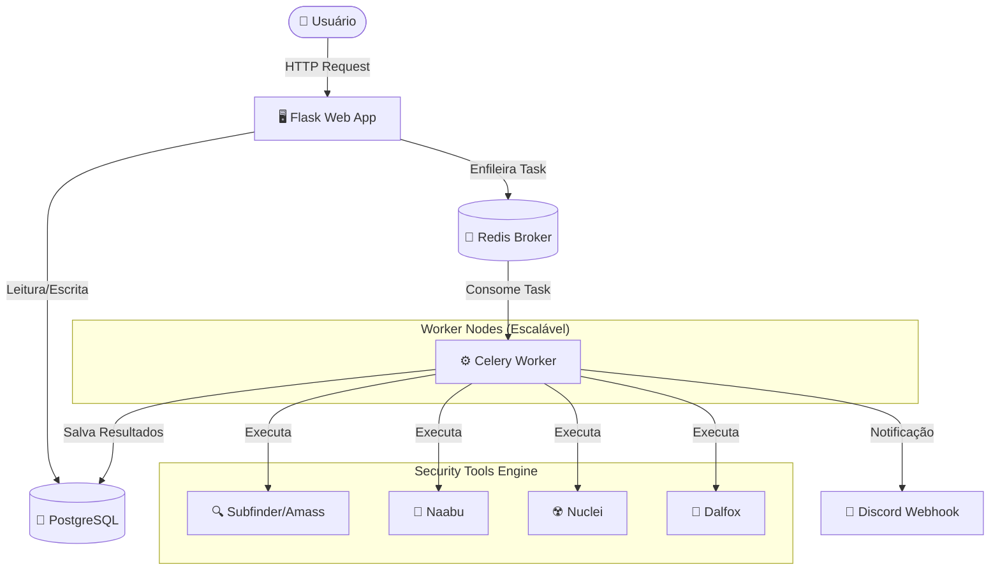

# 🛡️ BugBounty Monitor

> **Orquestrador de Segurança Ofensiva Automatizado**
>
> Uma plataforma robusta para gestão de reconhecimento (Recon) e análise de vulnerabilidades em escala, construída com arquitetura de microsserviços.


## 🧠 Arquitetura do Sistema

O projeto utiliza uma arquitetura assíncrona para garantir que scans pesados não travem a interface do usuário.


```mermaid
graph TD
    User([👤 Usuário]) -->|HTTP Request| Web[🖥️ Flask Web App]
    Web -->|Leitura/Escrita| DB[(🐘 PostgreSQL)]
    Web -->|Enfileira Task| Redis[(🔴 Redis Broker)]
    
    subgraph "Worker Nodes (Escalável)"
        Worker[⚙️ Celery Worker]
    end
    
    Redis -->|Consome Task| Worker
    Worker -->|Salva Resultados| DB
    
    subgraph "Security Tools Engine"
        Worker -->|Executa| Subfinder[🔍 Subfinder/Amass]
        Worker -->|Executa| Naabu[🔌 Naabu]
        Worker -->|Executa| Nuclei[☢️ Nuclei]
        Worker -->|Executa| Dalfox[🦊 Dalfox]
    end
    
    Worker -->|Notificação| Discord[📢 Discord Webhook]

```

---

## 🚀 Funcionalidades Principais

### 🔍 Reconhecimento (Recon) Flexível
* **Modos de Operação:**
    * **Automático:** Combinação de *Subfinder* e *Amass* para descoberta massiva.
    * **Híbrido e Manual:** O sistema processa o domínio principal E qualquer subdomínio inserido manualmente na lista "In-Scope", garantindo que ativos conhecidos sejam escaneados mesmo que não sejam descobertos automaticamente.
* **Live Check:** Filtragem de hosts ativos e coleta de *Tech Stack* via *HTTPX*.
* **Port Scanning:** Varredura rápida (Top 100) com *Naabu*, com filtros inteligentes para ignorar blocos CIDR/IPs massivos.
* **Enriquecimento:** Coleta automática de DNS (CNAME, MX) e IPs.

### 🛡️ Vulnerability Scanning
* **Engine de Templates:** Uso do *Nuclei* para detecção de CVEs, Misconfigurations e Exposures.
* **Pipeline XSS:** Fluxo integrado: `Crawler (Katana)` → `Histórico (GAU)` → `Scanner (Dalfox)`.
* **Smart Fuzzing:** Detecção de diretórios ocultos (*FFuf*) e CMS (*CMSeeK*).
    * *Configurável:* Toggle para ativar/desativar no Baseline.
    * *Automático:* Execução autônoma em novos subdomínios descobertos.
* **Controle de Escopo Dinâmico:**
    * *Out-of-Scope Dinâmico:* Domínios/IPs adicionados aqui são automaticamente ignorados em todas as fases do scan.
    * *In-Scope Persistente:* O que você digita manualmente fica salvo.
    * *Limpeza Retroativa:* Ao adicionar um domínio ou wildcard (*https://www.google.com/search?q=.dev.com) ao "Out of Scope", o sistema remove automaticamente registros proibidos já existentes no banco.

### 💻 Interface & Gestão
* **Dashboard Interativo:** Monitoramento em tempo real com estatísticas e logs de progresso.
* **Gestão Completa:** Criação, Edição e Exclusão de projetos e escopos.
* **Busca Inteligente:** Filtros avançados no estilo Discord (ex: `status:200 tech:nginx`).

### ⚙️ Diferenciais de Engenharia

* **Frontend Otimizado (HTMX):** Utiliza **Polling Adaptativo** (3s para scans ativos, 60s para ociosos), reduzindo drasticamente o consumo de rede e CPU.
* **Task Auto-Healing:** O sistema detecta automaticamente scans "zumbis" (travados por reinício de servidor) e corrige o status no Dashboard sem intervenção humana.
* **Smart Filtering:** Lógica de limpeza robusta para evitar que ferramentas de Recon tragam "lixo" (wildcards, ASNs, Ranges de IP de Cloud) para o banco de dados.
* **Seeding Automático:** O usuário Admin é criado automaticamente na primeira inicialização.

---

## 📂 Estrutura do Projeto

```text
BugBounty_Monitor/
├── app/
│   ├── static/          # Arquivos CSS/JS
│   ├── templates/       # HTML com Jinja2 e HTMX
│   ├── models.py        # Schema do Banco de Dados (SQLAlchemy)
│   ├── routes.py        # Endpoints da Aplicação
│   ├── scanner.py       # Wrappers para as ferramentas de CLI
│   ├── tasks.py         # Lógica dos Workers (Celery)
│   └── __init__.py      # Factory da Aplicação e Configs
├── docker-compose.yml   # Orquestração dos serviços
├── Dockerfile           # Imagem customizada com todas as tools instaladas
├── requirements.txt     # Dependências Python
└── .env                 # (Não versionado) Segredos e Configurações

```

---

## ⚙️ Instalação e Configuração

### Pré-requisitos

* [Docker](https://docs.docker.com/get-docker/) e [Docker Compose](https://docs.docker.com/compose/install/)

### 1. Clonar o Repositório

```bash
git clone https://github.com/Sonael/BugBounty_Monitor.git
cd BugBounty_Monitor

```

### 2. Configurar Variáveis de Ambiente

Crie um arquivo `.env` na raiz:

```bash
cp .env.example .env
```

**Tabela de Configuração (.env):**

| Variável | Descrição | Exemplo |
| --- | --- | --- |
| `POSTGRES_USER` | Usuário do Banco | `user` |
| `POSTGRES_PASSWORD` | Senha do Banco | `password` |
| `DATABASE_URL` | String de Conexão | `postgresql://user:password@db:5432/bugbounty` |
| `CELERY_BROKER_URL` | URL do Redis | `redis://redis:6379/0` |
| `SECRET_KEY` | Chave de Sessão Flask | `gere_uma_chave_segura` |
| `ADMIN_USER` | Usuário Inicial | `admin` |
| `ADMIN_PASSWORD` | Senha Inicial | `admin123` |
| `DISCORD_WEBHOOK_URL` | URL para Alertas | `https://discord.com/api/webhooks/...` |

### 3. Executar com Docker

```bash
docker-compose up -d --build

```

> **Nota:** Na primeira execução, o build pode demorar alguns minutos pois o Docker irá baixar e compilar ferramentas escritas em Go (Nuclei, Naabu, etc).

### 4. Acessar

Abra o navegador em: [http://localhost:5000](https://www.google.com/search?q=http://localhost:5000)

* **Login:** Use as credenciais definidas em `ADMIN_USER` e `ADMIN_PASSWORD`.

---

## 🔎 Guia de Filtros Avançados

O sistema utiliza uma sintaxe de busca inteligente que permite criar queries complexas combinando **E** (AND) e **OU** (OR).

### 🧠 Como funciona a Lógica?

1.  **Espaço ( ) separa blocos de busca:**
    * `tech:Nginx status:200` → Busca quem tem Nginx **E** Status 200.
2.  **Vírgula (,) agrupa valores:**
    * Para **Status** e **Subdomínio**: Funciona como **OU**.
        * `status:200,403` → Retorna resultados que sejam 200 **OU** 403.
    * Para **Tech**, **Portas** e **Path**: Funciona como **E** (Obrigatório ter todos).
        * `tech:Angular,Node` → Retorna apenas subdomínios que tenham Angular **E** Node juntos (Stack específica).

### Filtros Disponíveis

| Chave | Lógica da Vírgula | Descrição | Exemplo |
| :--- | :--- | :--- | :--- |
| **`status:`** | **OU** | Filtra pelo código de resposta HTTP. | `status:200,403` (Encontra 200 ou 403) |
| **`subdominio:`** | **OU** | Busca parcial no nome. | `subdominio:api,dev` (Contém "api" ou "dev") |
| **`tech:`** | **E (AND)** | Busca tecnologias (Stack). | `tech:PHP,Laravel` (Deve ter PHP **E** Laravel) |
| **`portas:`** | **E (AND)** | Busca portas abertas. | `portas:80,443` (Deve ter as duas abertas) |
| **`path:`** | **E (AND)** | Filtra diretórios encontrados. | `path:/.git,/admin` (Deve ter os dois) |

### 💡 Exemplos de Combinação (Power User)

* **Encontrar uma Stack Específica (AND):**
  Quero sites que usem *NodeJS* junto com *Express*.
```text
  tech:NodeJS,Express
```

* **Comparar Tecnologias (OR):**
Quero ver todos os sites *Java* e também todos os sites *PHP*.
```text
tech:Java tech:PHP
```

* **Busca de Vulnerabilidade Crítica:**
Quero painéis administrativos (*admin*) que retornem sucesso (*200*) e usem *WordPress*.
```text
subdominio:admin status:200 tech:WordPress
```

### Exemplos de Combinação

* **Encontrar painéis administrativos vivos:**
```text
  status:200 subdominio:admin
```

* **Buscar vazamento de arquivos Git em servidores Nginx:**
```text
tech:nginx path:/.git
```


* **Buscar serviços rodando em portas alternativas:**
```text
status:200 portas:8443
```

> **Nota:** Se você digitar texto sem uma chave (ex: `login`), o sistema fará uma busca geral no nome do domínio e nas tecnologias.


<div align="center">
<subdominio>Desenvolvido por <a href="https://github.com/Sonael">Sonael</a></subdominio>
</div>
